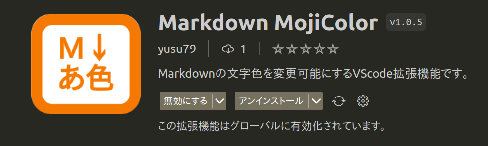

# vscode-markdown-mojicolor

Markdownの文字色を変更可能にするVScode拡張機能です｡

以下のように､`%文字%{色}`とすると､文字が指定した色でレンダリングされます｡

<!-- omit in toc -->
## 目次
- [インストール](#インストール)
- [使い方](#使い方)
- [解説](#解説)
- [参照サイト](#参照サイト)
- [使用しているmarkdown-itプラグイン](#使用しているmarkdown-itプラグイン)

## インストール
VScodeのマーケットプレイスで「Markdown MojiColor」と入力してください｡

## 使い方
| 入力                             | レンダリング                                                            | 説明                                                     | 
| -------------------------------- | ----------------------------------------------------------------------- | -------------------------------------------------------- | 
| `%トマト%{tomato}`               | `トマト`                            | 色を直接指定できます｡                                   | 
| `%イエロー%{#ffdc00}`            | `イエロー`                         | 16進数で色を指定できます｡                               | 
| `%イエロー%{イエロー}`           | `イエロー`                         | 日本語で指定すると､対応した16進数に変換します｡         | 
| `%桃%{桃色}`                     | `桃`                               | [和色](https://l.pg1x.com/X3e4)も指定できます｡          | 
| `%桃%{ももいろ}`                 | `桃`                               | 読み仮名でも指定できます｡                               | 
| `%アクア%{rgb(0,255,255)}`       | `アクア`                    | RGB表記で色を指定できます｡                              | 
| `%ビスク%{hsl(33,100%,88%)}`     | `ビスク`                  | HSL表記で色を指定できます｡                              | 
| `**%ビスク%{hsl(33,100%,88%)}**` | `<strong>ビスク</strong>` | 太字にしたいなら､`**%文字%{色}**`のようにしてください｡ | 

## 解説
`%文字%{色}`を`文字`に変換するmarkdown-itプラグインです｡

色は「色名」、「16進数」、「RGB」、「HSL」等で指定します。

色名は日本語にも対応しています。
例えば、`%文字%{桃色}`とすると､桃の色に近い`#f09199`に変換されます。

どの色に対応しているかは、[日本の伝統色 和色大辞典 - Traditional Colors of Japan](https://l.pg1x.com/X3e4)を参照してください。

## 参照サイト
- [日本の伝統色 和色大辞典 - Traditional Colors of Japan](https://l.pg1x.com/X3e4)
- [世界の伝統色 洋色大辞典 - Traditional Colors of World](https://l.pg1x.com/eT5p)
- [地下鉄のシンボルカラー メトロカラー - Metro Colors](https://l.pg1x.com/kCcm)
- [国鉄制定の塗装色 レールカラー(国鉄色) - Rail Colors](https://l.pg1x.com/iyJ7)

サイト元の原色大辞典( https://www.colordic.org/ )さんには、OSSでの公開と使用の許可を頂いております。

## 使用しているmarkdown-itプラグイン
- [yusu79/markdown-it-mojicolor](https://l.pg1x.com/sggo)
