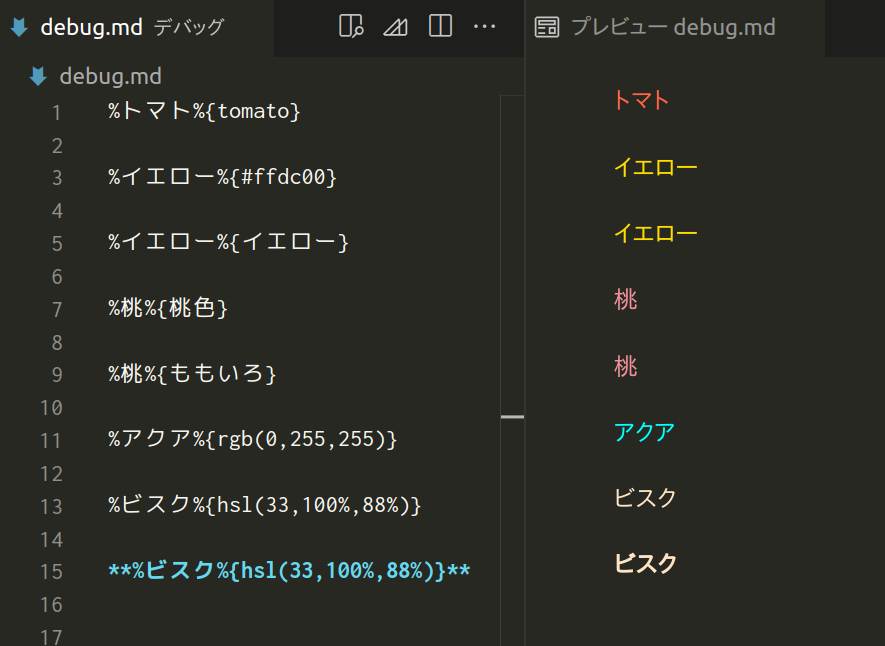

# vscode-markdown-mojicolor

Markdownの文字色を変更可能にするVScode拡張機能です｡

以下のように､`%文字%{色}`とすると､文字が指定した色でレンダリングされます｡

<!-- omit in toc -->
## 目次
- [使い方](#使い方)
- [使用しているmarkdown-itプラグイン](#使用しているmarkdown-itプラグイン)

## 使い方

Works:
| 入力                    | レンダリング                                           | 説明                                                     | 
| ----------------------- | ------------------------------------------------------ | -------------------------------------------------------- | 
| `%トマト%{tomato}`      | `トマト`                   | 色を直接指定できます｡                                   | 
| `%オレンジ%{#ffa500}`     | `オレンジ`                  | 16進数でも色を指定できます｡                             | 
| `**%オレンジ%{#ffa500}**` | `<strong>オレンジ</strong>` | 太字にしたいなら､`**%文字%{色}**`のようにしてください｡ | 

Doesn't work:
| 入力                      | レンダリング                                       | 説明                      | 
| -------------------------- | -------------------------------------------- | -------------------------------- | 
| `%アクア%{rgb(0,255,255)}`   | `アクア`   | `` はRGBをサポートしていません｡   | 
| `%ビスク%{hsb(33,23,100)}` | `ビスク` | `` はHSBをサポートしていません｡   | 
| `%**オレンジ**%{#ffa500}`    | `**オレンジ**`    | `%**文字**%{色}`のようにすると､太字にならず､そのまま記号として表示されます｡ | 

## 使用しているmarkdown-itプラグイン
- [yusu79/markdown-it-mojicolor](https://l.pg1x.com/sggo)
