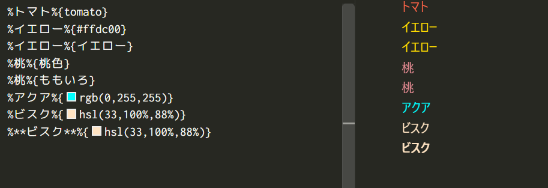
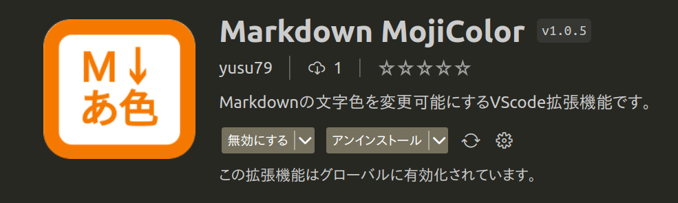
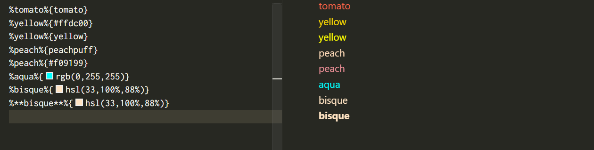

# vscode-markdown-mojicolor

[](https://github.com/yusu79/vscode-markdown-mojicolor/releases/latest)

[日本語](#vscode-markdown-mojicolor) | [English](#english)

Markdownの文字色を変更可能にするVS Code拡張機能です｡

以下のように､`%文字%{色}`とすると､文字が指定した色でレンダリングされます｡




### インストール
VS Codeのマーケットプレイスで「Markdown MojiColor」と入力してください｡

<p align="center">

</p>


### 使い方
| 入力                            | レンダリング                                                               | 説明                                    |
| ----------------------------- | -------------------------------------------------------------------- | ------------------------------------- |
| `%トマト%{tomato}`               | `<span style="color: tomato;">トマト</span>`                            | 色を直接指定できます｡                           |
| `%イエロー%{#ffdc00}`             | `<span style="color: #ffdc00;">イエロー</span>`                          | 16進数で色を指定できます｡                        |
| `%イエロー%{イエロー}`                | `<span style="color: #ffdc00;">イエロー</span>`                          | 日本語で指定すると､対応した16進数に変換します｡             |
| `%桃%{桃色}`                     | `<span style="color: #f09199;">桃</span>`                             | [和色](https://l.pg1x.com/X3e4)も指定できます｡ |
| `%桃%{ももいろ}`                   | `<span style="color: #f09199;">桃</span>`                             | 読み仮名でも指定できます｡                         |
| `%アクア%{rgb(0,255,255)}`       | `<span style="color: rgb(0,255,255);">アクア</span>`                    | RGB表記で色を指定できます｡                       |
| `%ビスク%{hsl(33,100%,88%)}`     | `<span style="color: hsl(33,100%,88%);">ビスク</span>`                  | HSL表記で色を指定できます｡                       |
| `%**ビスク**%{hsl(33,100%,88%)}` | `<span style="color: hsl(33,100%,88%);"><strong>ビスク</strong></span>` | 太字や斜体などのインライン記法を含めて、まとめて色付けできます｡    |


### 解説（Usage）
`%文字%{色}`を`<span style="color: 色">文字</span>`に変換するmarkdown-itプラグインです｡

色は「色名」、「16進数」、「RGB」、「HSL」等で指定します。

色名は日本語にも対応しています。
例えば、`%文字%{桃色}`とすると､桃の色に近い`#f09199`に変換されます。

どの色に対応しているかは、[日本の伝統色 和色大辞典 - Traditional Colors of Japan](https://l.pg1x.com/X3e4)を参照してください。


### 太字と斜体の自動着色
VS Code設定で太字と斜体の既定色を指定できます。

```json
{
  "markdownMojicolor.styles.bold": "blue",
  "markdownMojicolor.styles.italic": "桜色"
}
```

設定UIの入力欄を空にすると、その要素を自動着色しません。既存の`settings.json`で値を`null`にしている場合も、自動着色なしとして扱います。`%...%{色}`による明示的な指定は自動着色より優先されます。

文書ごとに変更する場合は、Markdownファイル先頭のYAML Front Matterで指定します。指定した項目だけがVS Code設定を上書きします。

```yaml
---
markdown:
  mojicolor:
    bold: yellow
    italic: null
---
```

この例では太字を黄色にし、斜体の自動着色を無効にします。Front Matterの設定はほかの文書へ引き継がれません。

入力途中の空の`mojicolor:`や`mojicolor: null`は設定なしとして扱い、VS Code設定を継承します。個別の`bold: null`・`italic: null`（値を省略した空キーを含む）は、その項目の自動着色を解除します。


### 色付き文字内のMarkdown
色を付ける範囲内でも、太字、斜体、リンク、インラインコードなどのMarkdown記法を使用できます。

```md
%**太字**と*斜体*%{blue}
%[リンク](https://example.com)%{blue}
%`インラインコード`%{blue}
```


### 色辞書の追加
`markdownMojicolor.colorFiles`に色辞書JSONの絶対パスを指定できます。

```json
{
  "markdownMojicolor.colorFiles": [
    "C:\\path\\to\\common-colors.json",
    "C:\\path\\to\\project-colors.json"
  ]
}
```

辞書は`{ "空色": "#00a6da" }`の形式で記述します。後に指定したファイルほど優先され、組み込み色も上書きできます。Markdown MojiColorの設定を変更すると、適用に必要なVS Codeウィンドウの再読み込みを確認するメッセージが表示されます。辞書ファイルの内容だけを変更した場合は設定変更イベントが発生しないため、VS Codeウィンドウを再読み込みしてください。


### 参照サイト（Reference Website）
- [日本の伝統色 和色大辞典 - Traditional Colors of Japan](https://www.colordic.org/w)
- [世界の伝統色 洋色大辞典 - Traditional Colors of World](https://www.colordic.org/y)
- [地下鉄のシンボルカラー メトロカラー - Metro Colors](https://www.colordic.org/m)
- [国鉄制定の塗装色 レールカラー(国鉄色) - Rail Colors](https://www.colordic.org/r)


サイト元の「[原色大辞典](https://www.colordic.org/)」さんには、OSSでの公開と使用の許可を頂いております。


### 使用しているプラグイン（Plugins）
- [yusu79/markdown-it-mojicolor](https://github.com/yusu79/markdown-it-mojicolor)

## English

[日本語](#vscode-markdown-mojicolor) | [English](#english)

A VS Code extension that lets you change text colors in Markdown previews.

Write `%text%{color}` to render the enclosed text in the specified color.



### Installation

Search for "Markdown MojiColor" in the VS Code Marketplace.

<p align="center">

</p>

### Quick usage

| Input | Rendering | Description |
| --- | --- | --- |
| `%tomato%{tomato}` | `<span style="color: tomato;">tomato</span>` | Specify a CSS color name directly. |
| `%yellow%{#ffdc00}` | `<span style="color: #ffdc00;">yellow</span>` | Specify a hexadecimal color. |
| `%yellow%{yellow}` | `<span style="color: yellow;">yellow</span>` | Specify a CSS color name directly. |
| `%peach%{peachpuff}` | `<span style="color: peachpuff;">peach</span>` | Specify another CSS color name. |
| `%peach%{#f09199}` | `<span style="color: #f09199;">peach</span>` | Specify the hexadecimal value of a Japanese traditional color. |
| `%aqua%{rgb(0,255,255)}` | `<span style="color: rgb(0,255,255);">aqua</span>` | Specify a color using RGB notation. |
| `%bisque%{hsl(33,100%,88%)}` | `<span style="color: hsl(33,100%,88%);">bisque</span>` | Specify a color using HSL notation. |
| `%**bisque**%{hsl(33,100%,88%)}` | `<span style="color: hsl(33,100%,88%);"><strong>bisque</strong></span>` | Bold, italic, and other inline Markdown syntax can be colored together. |


### Usage

The extension uses a markdown-it plugin that converts `%text%{color}` to `<span style="color: color">text</span>`.

Colors can be specified using color names, hexadecimal values, RGB, or HSL. Japanese color names are also supported. For example, `%text%{桃色}` is converted to the peach-like color `#f09199`.

See [Traditional Colors of Japan](https://l.pg1x.com/X3e4) for the supported Japanese traditional colors.

### Automatic coloring for bold and italic text

You can set default colors for bold and italic text in the VS Code settings UI or in `settings.json`.

```json
{
  "markdownMojicolor.styles.bold": "blue",
  "markdownMojicolor.styles.italic": "peachpuff"
}
```

Leave a setting blank to disable automatic coloring for that element. Existing `null` values in `settings.json` are also treated as disabled. An explicit `%...%{color}` always takes precedence over automatic coloring.

To override these settings for a single document, add `markdown.mojicolor` to the YAML Front Matter. Only the specified properties override the VS Code settings.

```yaml
---
markdown:
  mojicolor:
    bold: yellow
    italic: null
---
```

In this example, bold text is yellow and automatic coloring for italic text is disabled. Front Matter settings are not carried over to other documents.

An empty `mojicolor:` key or `mojicolor: null` entered while editing is treated as no document-level configuration, so the VS Code settings are inherited. An individual `bold: null` or `italic: null`, including a key with an omitted value, disables automatic coloring for that element.

### Markdown inside colored text

Markdown syntax such as bold, italic, links, and inline code can be used inside a colored range.

```md
%**bold** and *italic*%{blue}
%[link](https://example.com)%{blue}
%`inline code`%{blue}
```

### Adding color dictionaries

Set `markdownMojicolor.colorFiles` to absolute paths of additional color dictionary JSON files.

```json
{
  "markdownMojicolor.colorFiles": [
    "C:\\path\\to\\common-colors.json",
    "C:\\path\\to\\project-colors.json"
  ]
}
```

Each dictionary uses the form `{ "Sky Blue": "#00a6da" }`. Files listed later take precedence over earlier files and can override built-in colors. When a Markdown MojiColor setting changes, the extension prompts you to reload the VS Code window so the change can take effect. Editing only the contents of a dictionary file does not trigger a settings change event, so reload the VS Code window manually.

### Reference websites

- [Traditional Colors of Japan](https://www.colordic.org/w)
- [Traditional Colors of World](https://www.colordic.org/y)
- [Metro Colors](https://www.colordic.org/m)
- [Rail Colors](https://www.colordic.org/r)

The operator of [Color Dictionary](https://www.colordic.org/) has granted permission to publish and use its color data in this open-source project.

### Plugins

- [yusu79/markdown-it-mojicolor](https://github.com/yusu79/markdown-it-mojicolor)
